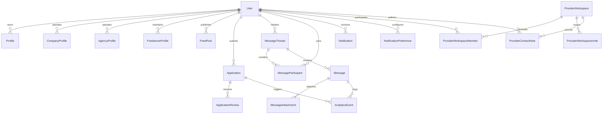

# Entity Relationship Diagram

**Diagram conventions**
- Double bars (`||`) indicate mandatory relationships (e.g., every `Application` requires a `User` applicant).
- Circles (`o{`) represent optional multi-valued relationships, reflecting that workspaces can have zero or more invites or members at any time.
- Analytics events are modelled as append-only records linked to the interaction that generated them, providing parity across applications, messaging, and provider operations.

Use the diagram alongside `schema-overview.md` to understand the authorised pathways for API design, caching, and analytics instrumentation.
