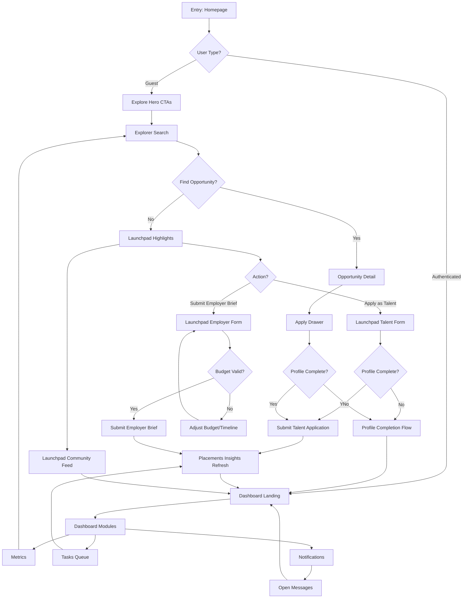

# Logic Flow Map – Web Application Version 1.00

## Interaction Notes
- Decision nodes include validation of authentication state and profile completeness.
- Loop from dashboard metrics back to explorer ensures continual discovery.
- Launchpad completion returns to dashboard with updated metric states and celebratory toast.
