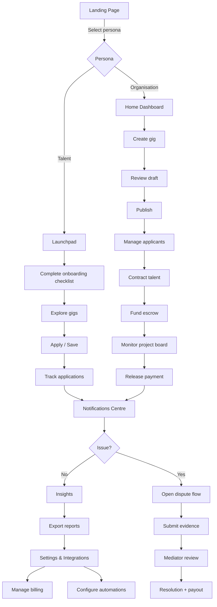

# Logic Flow Map – Web Application v1.50

- **Fallback loops:** If onboarding checklist incomplete, Launchpad returns to `C1` before unlocking advanced tabs.
- **Parallel processes:** Notifications centre aggregates events from applications, projects, disputes, and integrations concurrently.
- **Escalations:** Dispute flow triggers support ticket creation and optional live chat session.
